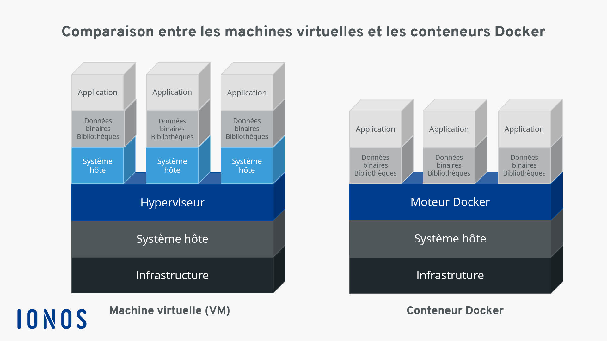

### Documentation

Ce fichier contient toutes les sources utiles à la création du projet.
Docuementation general.

### Table des matières

- [Introduction](#introduction)
	- [Lien externe](#lien-externe)
- [Configuration de l'environnement](#configuration-de-lenvironnement)
	- [Concepts de Virtualisation](#concepts-de-virtualisation)
	- [Hyperviseurs / Logiciels de virtualisation](#hyperviseurs--logiciels-de-virtualisation)
		- [Types d'hyperviseurs](#types-dhyperviseurs)
		- [Avantages des hyperviseurs](#avantages-des-hyperviseurs)
		- [Fonctionnement d'un hyperviseur](#fonctionnement-dun-hyperviseur)
- [Configuration de Docker et Docker Compose](#configuration-de-docker-et-docker-compose)
	- [Docker](#docker)
	- [Docker Compose](#docker-compose)
	- [Conteneurisés](#conteneurisés)
- [Déploiement des Services Conteneurisés](#déploiement-des-services-conteneurisés)
	- [Scalable](#scalable)
	- [Images Docker](#images-docker)
- [Bonnes Pratiques et Sécurité](#bonnes-pratiques-et-sécurité)
	- [Debian](#debian)
	- [DockerHub](#dockerhub)
	- [Consignes et Restrictions](#consignes-et-restrictions)
	- [Tag latest](#tag-latest)
- [Concepts Clés](#concepts-clés)
	- [NGINX et TLS](#nginx-et-tls)
	- [WordPress et PHP-FPM](#wordpress-et-php-fpm)
	- [MariaDB](#mariadb)
	- [Volume Docker](#volume-docker)
	- [FastCGI](#fastcgi)
	- [Hacky Patch](#hacky-patch)
	- [Daemons](#daemons)
	- [PID 1](#pid-1)
- [Partie Bonus](#partie-bonus)
	- [Redis Cache](#redis-cache)
	- [Serveur FTP](#serveur-ftp)
	- [Adminer](#adminer)
- [Conclusion](#conclusion)

---

## Introduction

Ce document a pour but de fournir des explications claires et concises sur les différents concepts, outils, et technologies utilisés dans le projet "Inception".

### Lien externe

Cours sur docker : https://www.nicelydev.com/docker

## Configuration de l'environnement

### Concepts de Virtualisation

**Virtualisation** : Technique permettant d'exécuter plusieurs systèmes d'exploitation sur une seule machine physique en utilisant des machines virtuelles (VM). Les avantages incluent :
- Meilleure utilisation des ressources matérielles.
- Isolation des applications.
- Simplification de la gestion et de la maintenance.

**VM (Machine Virtuelle)** : Un environnement d'exécution isolé, émulant un système physique complet, permettant d'exécuter des systèmes d'exploitation et des applications comme si c'était sur un matériel dédié.

### Hyperviseurs / Logiciels de virtualisation

Un **hyperviseur**, aussi appelé **logiciel de virtualisation**, est un programme qui permet de créer, exécuter et gérer plusieurs machines virtuelles (VM) sur un seul ordinateur physique. Il agit comme une couche intermédiaire entre le matériel de l'ordinateur et les machines virtuelles, permettant ainsi de partager les ressources (CPU, mémoire, réseau, etc.) de manière isolée et contrôlée.

#### Types d'hyperviseurs

1. **Hyperviseur de Type 1 (Bare-metal)** :
   - Il s'exécute directement sur le matériel physique, sans passer par un système d'exploitation hôte.
   - Principalement utilisé dans les serveurs ou pour des environnements de production.
   - Exemples : **Hyper-V**, **KVM**, **Proxmox VE**.

2. **Hyperviseur de Type 2 (Hosted)** :
   - Il s'exécute au-dessus d'un système d'exploitation déjà installé (comme Windows ou Linux).
   - Principalement utilisé pour des environnements de test ou de développement sur des ordinateurs personnels.
   - Exemples : **VirtualBox**, **VMware Workstation**.

#### Avantages des hyperviseurs

- **Isolation** : Chaque VM fonctionne indépendamment des autres, évitant les conflits entre applications.
- **Meilleure utilisation des ressources** : Permet d'utiliser pleinement les ressources du matériel physique en exécutant plusieurs systèmes d'exploitation.
- **Flexibilité** : Capacité d'exécuter plusieurs systèmes d'exploitation (Windows, Linux, etc.) simultanément sur la même machine.

#### Fonctionnement d'un hyperviseur

L'hyperviseur alloue dynamiquement des ressources matérielles à chaque VM. Chaque VM se comporte comme une machine indépendante avec son propre OS et ses applications, bien qu'elles partagent toutes le même matériel sous-jacent.

## Configuration de Docker et Docker Compose

### Docker

**Docker** : Une plateforme permettant de créer, déployer et exécuter des applications dans des conteneurs. Un conteneur est une unité standardisée de logiciel qui contient tout le code et toutes ses dépendances, garantissant que l'application s'exécute de manière fiable d'un environnement informatique à un autre.

### Docker Compose

**Docker Compose** : Un outil pour définir et gérer des applications multi-conteneurs Docker. Avec Docker Compose, vous utilisez un fichier `docker-compose.yml` pour configurer les services de votre application. Ensuite, une seule commande permet de créer et de démarrer tous les services à partir de votre configuration.

**Fichier `docker-compose.yml`** : Un fichier de configuration en YAML pour définir les services, réseaux et volumes nécessaires à votre application Docker.

### Conteneurisés

**Conteneurisés** : Se dit des applications ou services qui sont encapsulés dans des conteneurs Docker, permettant une exécution isolée et standardisée.

## Déploiement des Services Conteneurisés

### Scalable

**Scalable (Scalable)** : Capacité d'une application ou d'un service à gérer une augmentation du volume de travail ou à s'adapter à une augmentation de la demande en ajoutant des ressources.

### Images Docker

**Image Docker** : Un package léger et autonome qui inclut tout le nécessaire pour exécuter une application : le code, un runtime, des bibliothèques, des variables d'environnement et des fichiers de configuration.

## Bonnes Pratiques et Sécurité

### Debian

**Debian** : Une distribution de système d'exploitation libre et open-source, basée sur le noyau Linux. Elle est reconnue pour sa stabilité et sa fiabilité.

### DockerHub

**DockerHub** : Un service de registre en ligne pour trouver et partager des images Docker. Vous pouvez y stocker vos propres images ou utiliser des images publiques créées par d'autres utilisateurs.

### Consignes et Restrictions

**network: host, --link, links** : Des options de configuration de réseau pour les conteneurs Docker. `network: host` permet à un conteneur d'utiliser directement l'interface réseau de l'hôte, `--link` crée des connexions entre conteneurs, et `links` établit des relations de lien entre eux. Ces pratiques sont souvent déconseillées pour des raisons de sécurité et de maintenance.

### Tag latest

**Tag `latest`** : Un alias pour l'image Docker la plus récente d'un dépôt. Son utilisation est déconseillée car elle peut entraîner des problèmes de compatibilité et de stabilité si l'image change sans préavis.

## Concepts Clés

### NGINX et TLS

**NGINX** : Un serveur web et un reverse proxy performant, souvent utilisé pour servir des sites web statiques, comme proxy pour des serveurs applicatifs, ou pour équilibrer la charge.

**TLSv1.2 ou TLSv1.3** : Versions de Transport Layer Security (TLS), un protocole de chiffrement utilisé pour sécuriser les communications sur Internet.

[video explicatif et TLS](https://youtu.be/7W7WPMX7arI?si=0S2nsb-5eFJqXB-b)

### WordPress et PHP-FPM

**WordPress** : Un système de gestion de contenu (CMS) open-source utilisé pour créer des sites web et des blogs.

**PHP-FPM (FastCGI Process Manager)** : Une alternative au gestionnaire de processus PHP FastCGI, conçu pour des sites à forte charge, améliorant les performances de PHP en le gérant mieux.

### MariaDB

**MariaDB** : Un système de gestion de bases de données relationnelles open-source, dérivé de MySQL.

### Volume Docker

**Volume Docker** : Une méthode pour stocker des données persistantes utilisées et générées par des conteneurs Docker, indépendamment du cycle de vie des conteneurs eux-mêmes.

### FastCGI

**FastCGI** : Un protocole qui permet à NGINX de communiquer avec des applications dynamiques comme PHP de manière plus efficace. Contrairement à CGI classique, FastCGI réutilise les processus existants pour traiter plusieurs requêtes, réduisant ainsi les coûts liés à la création de nouveaux processus à chaque requête et améliorant les performances.

### Hacky Patch

**Hacky Patch** : Une solution temporaire et souvent mal conçue pour résoudre un problème rapidement, sans se soucier des bonnes pratiques ou de la pérennité de la solution.

### Daemons

**Daemons** : Des programmes qui s'exécutent en arrière-plan sur un système d'exploitation, généralement pour gérer des services ou des tâches spécifiques.

### PID 1

**PID 1** : Le premier processus lancé par le noyau du système d'exploitation lors de son démarrage, souvent responsable de la gestion des autres processus du système. Dans Docker, il est important de s'assurer que le processus PID 1 est correctement géré pour éviter les problèmes de signalisation et de terminaison des conteneurs.

## Partie Bonus

### Redis Cache

**Redis Cache** : Un magasin de données en mémoire, utilisé comme base de données, cache et courtier de messages. Il permet de stocker des données temporaires pour améliorer les performances des applications.

### Serveur FTP

**Serveur FTP (File Transfer Protocol)** : Un serveur utilisé pour transférer des fichiers entre des ordinateurs sur un réseau.

### Adminer

**Adminer** : Un outil de gestion de base de données basé sur le web, permettant d'administrer des bases de données MySQL, PostgreSQL, SQLite, MS SQL, Oracle, etc.

## Conclusion

Cette documentation fournit une vue d'ensemble des concepts et outils nécessaires pour réussir le projet "Inception". Pour des explications plus détaillées sur certains sujets complexes, des fichiers supplémentaires dans le dossier `concepts` peuvent être créés.
