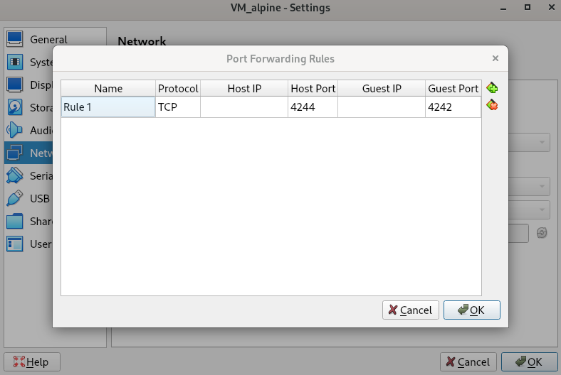
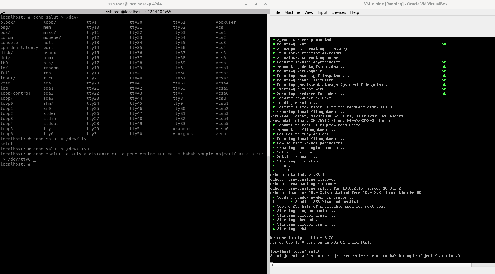

### 1.5 Utilisation de SSH

> **Optionnelle** mais très utile, elle permet de faire des copier-coller depuis votre PC hôte vers la VM.

Étape intermédiaire après [la création de la VM](./1_Creation_de_la_VM.md). Ce fichier a pour objectif de documenter l'installation et la configuration de SSH afin de pouvoir manipuler la VM à distance, principalement pour les systèmes basés sur Linux. Pour Windows, je n'ai pas encore de solution précise.

Cela permet de gérer la VM plus facilement et d'être plus à l'aise dans son administration, plutôt que de travailler directement depuis son interface.

## Qu'est-ce que SSH ?

SSH (Secure Shell) est un protocole réseau cryptographique qui permet de se connecter à une machine distante de manière sécurisée. Il est couramment utilisé pour administrer des serveurs et des machines virtuelles à distance via une interface en ligne de commande.

### Objectif

J'ai une VM et je souhaite utiliser mon PC pour gérer cette VM depuis le terminal. L'objectif est de me connecter à la VM et d'afficher un message de bienvenue une fois connecté.

## Comment faire ?

### 1. Installer SSH

Tout d'abord, il faut installer le serveur SSH sur la VM :

```sh
apk update
apk add openssh
```

Pour vérifier que SSH est bien installé, exécute la commande suivante :

```sh
ssh -V
```

Cela affichera la version de SSH installée.

### 2. Configurer SSH

#### Activer SSH au démarrage

Pour démarrer automatiquement le service SSH au démarrage du système, utilise cette commande :

```sh
rc-update add sshd
```

Puis démarre immédiatement le service SSH :

```sh
service sshd start
```

### 3. Autoriser la connexion root (optionnel)

Par défaut, la connexion SSH root est désactivée sur Alpine. Si tu veux l'activer (optionnel), modifie le fichier de configuration SSH :

```sh
vi /etc/ssh/sshd_config
```

Trouve et modifie la ligne suivante :

```sh
#PermitRootLogin prohibit-password
```

Remplace-la par :

```sh
PermitRootLogin yes
```

Tu peux également changer le port d'écoute pour le mettre à 4242. Trouve et modifie la ligne suivante :

```sh
#Port 22
```

Remplace-la par :

```sh
Port 4242
```

Sauvegarde et quitte l'éditeur. Ensuite, redémarre le service SSH pour appliquer les changements :

```sh
service sshd restart
```

### 4. Configurer VirtualBox

Avant de pouvoir se connecter, tu dois rediriger le port de la VM vers ton PC hôte dans VirtualBox. 

- Va dans **VirtualBox >> Paramètres >> Réseaux >> Adaptateur 1 >> Avancé >> Redirection de ports**.
- Ajoute une règle avec les paramètres suivants :
  - **Host port** : 4244
  - **Guest port** : 4242



Après avoir configuré la redirection de port, réactive le service SSH pour appliquer le changement.

### 5. Vérification de la connexion

Enfin, vérifie si la connexion SSH fonctionne en essayant de te connecter depuis le terminal de ton PC hôte :

```sh
ssh root@localhost -p 4244
```

Ou si tu connais l'adresse IP de la VM :

```sh
ssh root@<ip_de_la_vm> -p 4244
```

Pour afficher le message sur un terminal spécifique de la VM, utilise la commande suivante :

```sh
tty
```

Puis exécute cette commande sur la VM pour envoyer un message sur le terminal :

```sh
echo "salut" > [résultat_de_tty_de_la_vm]
```

**Objectif atteint !**



### Conclusion

À ce stade, tu peux maintenant te connecter à ta VM à distance via SSH, ce qui rend l'administration de la VM plus facile et plus flexible. Tu peux désormais travailler directement depuis ton terminal, sans avoir à manipuler l'interface graphique.
