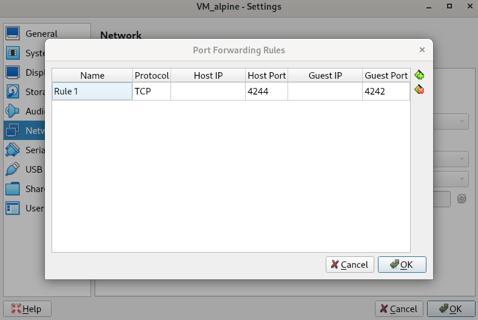
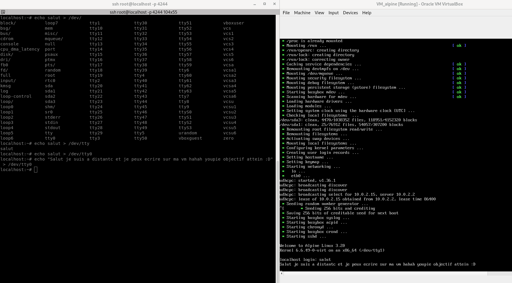

# 1.5 Utilisation de SSH

> Optionelle

Étape intermédiaire après [la création de la VM](./1_Creation_de_la_VM.md).<br>
Ce fichier a pour objectif de documenter l'installation et la configuration de SSH afin de pouvoir manipuler la VM à distance.<br>
Cela me permet de gérer la VM plus facilement et d'être plus à l'aise dans son administration, plutôt que de travailler directement depuis son interface.

## Qu'est-ce que SSH ?

SSH (Secure Shell) est un protocole réseau cryptographique qui permet de se connecter à une machine distante en toute sécurité.<br>
Il est couramment utilisé pour administrer des serveurs et des machines virtuelles à distance, via une interface en ligne de commande.<br>

### Objectif

J'ai une VM et je souhaite utiliser mon PC pour gérer cette VM depuis le terminal.<br>
Mon objectif est de pouvoir me connecter à la VM et afficher un message de bienvenue une fois connecté.

## Comment faire ?

1. Installer SSH grâce à cette commande : 
    ```sh
    apk update
    apk add openssh
    ```
   Pour vérifier que SSH est installé, il faut faire :
    ```sh
    ssh -V
    ```
   Cela affichera la version de SSH.

2. **Configurer SSH**
   - Active le démarrage automatique de SSH au démarrage du système :
     ```sh
     rc-update add sshd
     ```
   - Démarre le service SSH immédiatement :
     ```sh
     service sshd start
     ```

3. **Autoriser la connexion root (optionnel)**
   Par défaut, la connexion SSH root est désactivée sur Alpine. Si tu veux l'activer (optionnel), modifie le fichier de configuration SSH :
   ```sh
   vi /etc/ssh/sshd_config
   ```
   Ensuite, trouve et modifie la ligne suivante :
   ```sh
   #PermitRootLogin prohibit-password
   ```
   Remplace-la par :
   ```sh
   PermitRootLogin yes
   ```

   J'ai aussi changé le port d'écoute pour le mettre en 4242. Trouve et modifie la ligne suivante :
   ```sh
   #Port 22
   ```
   Remplace-la par :
   ```sh
   Port 4242
   ```

   Sauvegarde et quitte l'éditeur.

   Enfin, redémarre le service SSH pour appliquer les changements :
   ```sh
   service sshd restart
   ```

4. **Configurer VirtualBox**
   Il reste maintenant à ajouter une règle de VirtualBox avant de se connecter afin de rediriger le port host et guest.

   Rediriger le port hôte 4244 vers le port invité 4242 : dans VirtualBox,

   * Va sur VirtualBox >> Paramètre >> Réseaux >> Adapter 1 >> Avancé >> Port Forwarding.
   * Ajoute une règle : Host port 4244 et guest port 4242.

   

   Réactive le service SSH après le changement.

5. **Vérification de la connexion**
   Vérifions si cela marche en essayant de nous connecter depuis le terminal du PC :

    ```sh
    ssh root@localhost -p 4244
    ```
   ou
    ```sh
    ssh root@<ip de la vm> -p 4244
    ```

   Pour connaître sur quel terminal afficher le message, utilise la commande :
    ```sh
    tty
    ```

   Puis fais :
    ```sh
    echo "salut" > [resultat de tty de la vm]
    ```

**Objectif atteint !**



À partir de ce moment-là, on peut se connecter à distance à notre VM, ce qui nous permet d'être plus à l'aise et versatile. À présent, je vais faire mon fichier `.vimrc` et commencer la conteneurisation. Et aussi intaller le paquet git.
