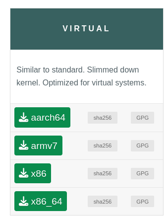

# 1. Création de la VM

Première étape du projet : créer la Machine Virtuelle (VM).  
Dans ce fichier, il y aura :

- [1. Création de la VM](#1-création-de-la-vm)
	- [Notions à savoir](#notions-à-savoir)
		- [Virtualisation](#virtualisation)
		- [ISO et OS](#iso-et-os)
	- [Quel choix faire ?](#quel-choix-faire-)
	- [Quel Hyperviseur / Logiciel de virtualisation ?](#quel-hyperviseur--logiciel-de-virtualisation-)
		- [Choix d'un OS](#choix-dun-os)
	- [Comment créer la VM ?](#comment-créer-la-vm-)
		- [Installation pour Alpine sur VirtualBox :](#installation-pour-alpine-sur-virtualbox-)
		- [Installation Debian](#installation-debian)
		- [Installation Windows](#installation-windows)

## Notions à savoir

### Virtualisation

La [virtualisation](./../concepts/documentation.md#concepts-de-virtualisation) est la technologie qui permet de créer des environnements virtuels, comme des machines virtuelles (VM), sur du matériel physique. Cela permet d'exécuter plusieurs systèmes d'exploitation ou applications de manière isolée, tout en partageant les ressources physiques.

Le logiciel qui nous permet de faire la virtualisation s'appelle un [Hyperviseur ou logiciel de virtualisation](./../concepts/documentation.md#hyperviseurs--logiciels-de-virtualisation).

- Voici un tableau des [logiciels de virtualisation / hyperviseurs](./../concepts/documentation.md#hyperviseurs--logiciels-de-virtualisation) permettant de manipuler et créer des machines virtuelles (VM) :

| **Logiciel de virtualisation**              | **Description**                                                                 | **Plateforme**           | **Licence**         |
|---------------------------------------------|---------------------------------------------------------------------------------|--------------------------|---------------------|
| [**VirtualBox**](https://www.virtualbox.org/)             | Open-source, permet de créer et gérer des VM sur divers systèmes d'exploitation. | Windows, macOS, Linux     | Gratuit, Open-source |
| [**VMware Workstation Player**](https://www.vmware.com/products/desktop-hypervisor/workstation-and-fusion) | Version gratuite de VMware pour exécuter des VM.                               | Windows, Linux            | Gratuit              |
| [**VMware Workstation Pro**](https://www.vmware.com/products/desktop-hypervisor/workstation-and-fusion) | Version payante avec des fonctionnalités avancées pour créer et gérer des VM.    | Windows, Linux            | Payant               |
| [**Hyper-V**](https://learn.microsoft.com/fr-fr/virtualization/hyper-v-on-windows/quick-start/enable-hyper-v)                | Hyperviseur intégré à Windows pour créer et gérer des VM.                         | Windows Pro, Enterprise   | Gratuit (inclus avec Windows) |
| [**KVM (Kernel-based Virtual Machine)**](https://www.linux-kvm.org/page/Downloads) | Hyperviseur intégré au noyau Linux pour la virtualisation.             | Linux                     | Gratuit, Open-source |
| [**Proxmox VE**](https://www.proxmox.com/en/proxmox-virtual-environment/overview)             | Plateforme de virtualisation open-source pour VM et conteneurs.                  | Linux                     | Gratuit, Open-source |
| [**QEMU**](https://www.qemu.org/)                   | Émulateur et virtualiseur open-source pour plusieurs OS.                         | Windows, macOS, Linux     | Gratuit, Open-source |

### ISO et OS

**Qu'est-ce qu'un ISO ?**

Un **ISO** est un type de **fichier image** qui représente une copie exacte d'un disque optique (CD, DVD). Il contient toutes les données et la structure du disque original, y compris les fichiers de démarrage, les partitions et la disposition des fichiers. Les fichiers ISO sont souvent utilisés pour installer des systèmes d'exploitation (OS) sur des machines virtuelles ou physiques sans utiliser de support physique comme un CD ou un DVD. 

**Qu'est-ce qu'un fichier image ?**

Un **fichier image** est une réplique numérique complète d'un support de stockage (comme un CD, DVD, ou disque dur), qui conserve non seulement les fichiers eux-mêmes, mais aussi la structure et les informations de démarrage. Les fichiers image sont utilisés pour créer des copies précises des disques et peuvent être montés ou gravés pour répliquer l'environnement du disque original.

**Qu'est-ce qu'un OS ?**

Un **OS (Operating System)** ou système d'exploitation est le logiciel principal qui gère les ressources matérielles d'un ordinateur et fournit des services aux applications. Il est responsable de la gestion des fichiers, de l'exécution des programmes et de la communication avec le matériel. Les exemples les plus connus sont **Windows**, **Linux (Debian, Ubuntu)**, et **macOS**.

---

## Quel choix faire ?

## Quel Hyperviseur / Logiciel de virtualisation ?

VirtualBox est celui utilisé sur les PC de l'école. J'ai déjà travaillé dessus.

> Je choisis VirtualBox.

### Choix d'un OS

Cela n'a pas d'importance pour le projet, puisque Docker nous permettra d'utiliser n'importe quel OS pour les services.
Juste pour le projet, il est recommandé d'installer un OS avec une interface graphique.

> Je choisie Alpine.

## Comment créer la VM ?

Si vous rencontrez des difficultés, voici une démonstration :

### Installation pour Alpine sur VirtualBox :

1. Obtenir l'ISO d'Alpine, voici le [lien](https://alpinelinux.org/downloads/) pour les différents ISO d'Alpine :  
   J'ai choisi x86_64.  
   

[Vidéo de démonstration](https://youtu.be/X7R5oBTb-Tg?si=Z48xGkNkVboBPeya)  
Documentation Alpine : https://wiki.alpinelinux.org/wiki/Main_Page

Suivre ce [tutoriel](https://www.linuxtricks.fr/wiki/alpine-linux-installer-un-environnement-de-bureau-xfce) pour installer une interface graphique,  
ou exécuter ce script qui installe l'interface graphique : [installation d'interface graphique sur Alpine](./../script/install_interface_graphique.sh).

Suivre la vidéo de démonstration mais après avoir installé, se connecter en tant que root et exécuter `setup-alpine`, puis configurer les paramètres d'installation.

### Installation Debian

1. Obtenir l'ISO de Debian : https://www.debian.org/download.fr.html  
2. Et débrouillez-vous... avec VirtualBox / votre hyperviseur pour créer votre VM.

### Installation Windows

1. Obtenir l'ISO de Windows : https://www.microsoft.com/fr-fr/software-download/windows11  
2. Même moi, je ne sais plus comment faire l'installation de Windows, mdr. Débrouillez-vous !
[Vidéo de démonstration](https://youtu.be/rp6IR3BnPs0?si=ctIE8LCzSvZ5mDPU)
