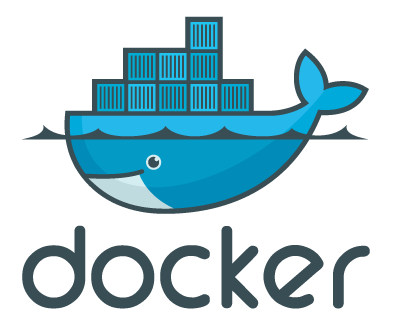

# 2. Installation de Docker et Docker Compose

Deuxième étape du projet : installation de Docker.  
Voici ce qu'il y aura dans ce fichier :

## C'est quoi Docker ?



Il y a des explications détaillées dans la [documentation](./../concepts/documentation.md#docker). Mais voici un rappel.

Docker est [une plateforme](./../concepts/Plateforme_vs_aplication.md) open-source permettant de créer, déployer et exécuter des applications dans des conteneurs.  
Les conteneurs sont des environnements légers et portables qui isolent les applications et leurs dépendances, garantissant ainsi que celles-ci fonctionnent de manière cohérente sur différents environnements.

## Que permet Docker ?

En résumé, Docker permet de faire fonctionner des services et des applications comme Nginx, MariaDB, et WordPress, peu importe l'OS de base.

Docker Compose permet de gérer plusieurs images et de les faire interagir entre elles.

[Documentation Docker vs Docker Compose](./../concepts/docker_vs_docker_compose.md)

- **Isolation** : Les conteneurs permettent d'exécuter des applications dans des environnements isolés, réduisant ainsi les conflits entre les dépendances.
- **Portabilité** : Les conteneurs Docker peuvent être déployés sur n'importe quel système prenant en charge Docker, que ce soit en local, sur un serveur ou dans le cloud.
- **Consistance** : Docker assure que les applications se comportent de la même manière sur différents environnements de développement, de test et de production.
- **Scalabilité** : Docker facilite le déploiement de multiples instances d'applications et leur mise à l'échelle horizontale.
- **Efficacité** : Les conteneurs partagent le noyau du système d'exploitation hôte, ce qui les rend plus légers et rapides par rapport aux machines virtuelles traditionnelles.

## Comment installer Docker et Docker Compose sur Alpine ?

### Étape 1 : Ajouter le dépôt Community

Docker est disponible dans le dépôt `community` d'Alpine. Assurez-vous que ce dépôt est activé dans votre fichier `/etc/apk/repositories`. Vous pouvez le vérifier en ouvrant ce fichier avec un éditeur de texte, comme `vi` :

```sh
vi /etc/apk/repositories
```

Vérifiez que la ligne suivante est présente, et ajoutez-la si nécessaire :

```sh
http://dl-cdn.alpinelinux.org/alpine/v3.15/community
```

(Remplacez `v3.15` par la version d'Alpine que vous utilisez.)

### Étape 2 : Installer Docker

voici le script [installation_de_docker](./../script/installation_de_docker.sh)

1. **Mettre à jour les paquets :**

   ```sh
   apk update
   ```

2. **Installer Docker :**

   ```sh
   apk add docker
   ```

3. **Démarrer et activer Docker :**

   ```sh
   service docker start
   rc-update add docker
   ```

4. **Vérifier que Docker fonctionne correctement :**

   ```sh
   docker --version
   ```

### Étape 3 : Installer Docker Compose

voici le script [installation_de_docker_compose](./../script/installation_de_docker_compose.sh)

1. **Mettre à jour les paquets :**

   ```sh
   apk update
   ```

2. **Installer les dépendances nécessaires :**

   ```sh
   apk add --no-cache curl py3-pip
   ```

3. **Télécharger la dernière version stable de Docker Compose :**

   ```sh
   DOCKER_COMPOSE_VERSION=$(curl -s https://api.github.com/repos/docker/compose/releases/latest | grep 'tag_name' | cut -d\" -f4)
   curl -L "https://github.com/docker/compose/releases/download/${DOCKER_COMPOSE_VERSION}/docker-compose-$(uname -s)-$(uname -m)" -o /usr/local/bin/docker-compose
   ```

4. **Ajouter les droits d'exécution à Docker Compose :**

   ```sh
   chmod +x /usr/local/bin/docker-compose
   ```

5. **Vérifier que Docker Compose fonctionne correctement :**

   ```sh
   docker-compose --version
   ```
