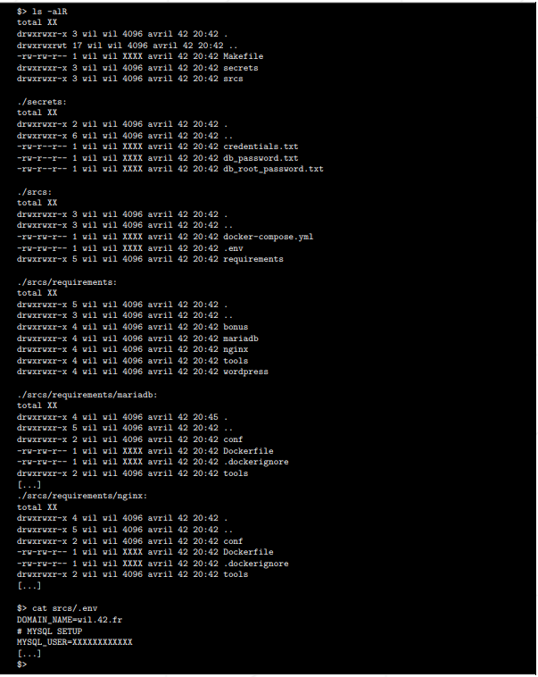

# L'installation des service grace a docker 

Apres avoir installer docker et docker compose je peux commencer a le configurer voici mon plan

## 1. Preparer le dossier rendu

Le sujet montre un exemple d'arborescence , comme illustré ci-dessous :



Voici une explication des différents fichiers/dossiers :
- `Makefile` : Utilisé pour automatiser la compilation et la gestion des services Docker.
- `secrets/` : Contient des fichiers sensibles comme les mots de passe de la base de données. **Note : Ces informations doivent être protégées et ne jamais être incluses dans Git.**
- `srcs/` : Contient tous les fichiers nécessaires pour configurer et exécuter les services Docker.
  - `docker-compose.yml` : Fichier principal pour orchestrer les différents services conteneurisés.
  - `.env` : Fichier d'environnement pour stocker les variables sensibles.

```sh
.
├── Makefile
├── secrets
│   ├── credentials.txt
│   ├── db_password.txt
│   └── db_root_password.txt
└── srcs
	├── docker-compose.yml
	├── .env
	└── requirements
		├── bonus
		│   └── [...]
		├── mariadb
		│   ├── conf
		│   ├── Dockerfile
		│   ├── .dockerignore
		│   └── tools
		├── nginx
		│   ├── conf
		│   ├── Dockerfile
		│   ├── .dockerignore
		│   └── tools
		├── tools
		└── wordpress
			└── [...]
```

## 2. [Comence a installer le service NGINX](./Instalation_des_services/1_Instalation_Nginx.md)


dans le dossier [nginx](./../rendu/srcs/requirements/nginx/) rediger le docker file et toute infomation utile.

Objectif : **[Mettre en place un conteneur contenant NGINX avec TLSv1.2 qui fera office de serveur web.](./Instalation_des_services/1_Instalation_Nginx.md)**

## 2. [Comence a installer le service MariaDB](./Instalation_des_services/2_Instalation_MariaDB.md)


dans le dossier [mariadb](./../rendu/srcs/requirements/mariadb/) rediger le docker file et toute infomation utile.

Objectif : **[Mettre en place un conteneur contenant MariaDb qui fera office de gestion de base de donnée](./Instalation_des_services/2_Instalation_MariaDB.md)**