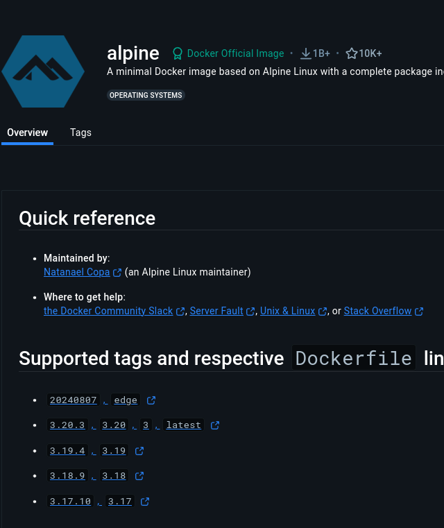

# 1. Installation de Nginx

Objectif : Mettre en place un conteneur contenant NGINX avec TLSv1.2

voir [les règles](./../../concepts/regle_du_projet.md).

## Lecon

1. Rediger un docker file
2. Genere un certificat SSL 
3. 
## C'est quoi

qu'es que c'est que [NGINX](./../../concepts/documentation.md#nginx-et-tls) et [TLSv](./../../concepts/documentation.md#nginx-et-tls) ?

## Comment faire ?

1. **Créer un Dockerfile pour Nginx**  
   Le Dockerfile doit définir l'image de base (Alpine ou Debian), installer Nginx et configurer le support de TLSv1.2.

   - Comment crée [un dockerfile](./../../concepts/Dockerfile_info.md) ?
   - connaitre [l'avant derniere version d'alpine le 15 septembre 2024](https://hub.docker.com/_/alpine)? il s'agit de la 3.19 : 
contenue du dockerfile :

```dockerfile
# 1. Utiliser une image de base Alpine
FROM alpine:3.19

# 2. Installer les dépendances nécessaires (Nginx et OpenSSL -> pour tsl)
RUN apk add --no-cache nginx openssl

# 3. Copier les fichiers de configuration Nginx
COPY ./conf/nginx.conf /etc/nginx/nginx.conf

# 4. Copier les certificats SSL (assurez-vous que les certificats sont présents dans le même répertoire que le Dockerfile)
COPY ssl/ /etc/nginx/ssl/

# 5. Exposer le port 443 pour HTTPS / et demander dans le sujet +
EXPOSE 443

# 6. Définir le répertoire de travail
WORKDIR /etc/nginx

# 7. Démarrer Nginx en arrière-plan
CMD ["nginx", "-g", "daemon off;"]
```

2. **Configurer TLS dans Nginx**  
   - Générer un certificat SSL avec OpenSSL ou utiliser Let's Encrypt.
   - Modifier la configuration de Nginx pour supporter TLSv1.3 et pointer vers le certificat.

3. **Mettre à jour `docker-compose.yml`**  
   Ajouter un service pour Nginx, en spécifiant le Dockerfile et en mappant les ports 80 et 443.

4. **Tester la configuration**  
   Vérifier que Nginx fonctionne et que la connexion HTTPS utilise bien TLSv1.2.