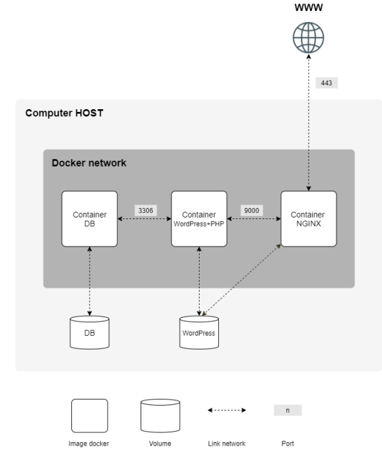

# Objectifs du Projet Inception

## Table of Contents / Sommaire
- [Objectifs du Projet Inception](#objectifs-du-projet-inception)
	- [Table of Contents / Sommaire](#table-of-contents--sommaire)
	- [Introduction](#introduction)
	- [Objectifs](#objectifs)
	- [Objectifs détaillés](#objectifs-détaillés)
		- [Rendus](#rendus)
		- [Consignes](#consignes)
		- [Interdictions](#interdictions)
		- [Mise en place](#mise-en-place)
		- [Conseils](#conseils)
		- [Paramétrage des services mis en place](#paramétrage-des-services-mis-en-place)
	- [Exemple de structure attendue](#exemple-de-structure-attendue)

## Introduction

Ce fichier détaille les objectifs spécifiques du projet "Inception" en fonction du [sujet fourni](./fr.subject.Inception.pdf).

## Objectifs

1. **Comprendre les concepts de virtualisation** :
   - Appréhender les bases de la virtualisation et ses avantages.
   - Étudier les différentes technologies de virtualisation disponibles.

2. **Configurer un environnement Docker** :
   - Installer et configurer Docker et Docker Compose.
   - Créer et gérer des images Docker pour différents services (NGINX, WordPress, MariaDB).

3. **Déployer des services conteneurisés** :
   - Utiliser Docker Compose pour orchestrer plusieurs conteneurs.
   - Mettre en place une infrastructure scalable et sécurisée.

4. **Documentation et bonnes pratiques** :
   - Documenter chaque étape du projet.
   - Appliquer les bonnes pratiques en matière de sécurité et de gestion des conteneurs.

## Objectifs détaillés

### Rendus

1. Créer une VM.
2. Les rendus seront dans le dossier `srcs` et contiendront tous les fichiers nécessaires.
3. Un Makefile dans `rendu` devra construire tout ce qui est dans `srcs` avec Docker Compose. Il doit permettre de mettre en place toute votre application (c’est-à-dire, construire les images Docker via `docker-compose.yml`).

### Consignes

1. Utiliser Docker Compose.
2. Chaque image Docker sera nommée par son service.
3. Chaque service doit être dans un conteneur dédié.
4. Utiliser la version stable avant-dernière de Debian pour les conteneurs.
5. Chaque conteneur doit avoir un Dockerfile écrit par vous.
6. Les Dockerfiles seront appelés dans votre fichier `docker-compose.yml` via votre Makefile.

Pour des raisons de sécurité, tous les identifiants, clés API, variables d'environnement, etc., doivent être enregistrés localement dans différents fichiers et ignorés par git. Les informations d’identification stockées publiquement vous conduiront directement à un échec du projet.

Vous pouvez stocker vos variables (comme un nom de domaine) dans un fichier `.env`.

### Interdictions

- Il est interdit d'utiliser des images toutes faites ou des services tels que DockerHub (sauf Alpine et Debian).
- L’utilisation de `network: host`, `--link`, ou `links:` est interdite. La ligne `network(s)` doit être présente dans votre fichier `docker-compose.yml`.
- Vos conteneurs ne doivent pas démarrer avec une commande faisant tourner une boucle infinie (exemples : `tail -f`, `bash`, `sleep infinity`, `while true`, etc.).
- Le tag `latest` est interdit.
- Aucun mot de passe ne doit être présent dans vos Dockerfiles.
- L’utilisation des variables d’environnement est obligatoire.
- La mise en place d’un fichier `.env` pour stocker vos variables d’environnement est fortement conseillée et l’utilisation de Docker secrets pour stocker toute information confidentielle est fortement recommandée.
- Votre conteneur NGINX doit être le seul point d’entrée de votre infrastructure par le port 443 uniquement en utilisant le protocole TLSv1.2 ou TLSv1.3.

### Mise en place



- Un conteneur Docker contenant NGINX avec TLSv1.2 ou TLSv1.3 uniquement.
- Un conteneur Docker contenant WordPress + php-fpm (installé et configuré) uniquement sans NGINX.
- Un conteneur Docker contenant MariaDB uniquement sans NGINX.
- Un volume contenant votre base de données WordPress.
- Un second volume contenant les fichiers de votre site WordPress.
- Un réseau Docker qui fera le lien entre vos conteneurs.

Vos conteneurs devront redémarrer en cas de crash.

```
Un conteneur Docker n’est pas une machine virtuelle, il n’est donc pas recommandé d’utiliser des "hacky patch" à base de `tail -f` et compagnie lors de son exécution. Informez-vous sur le fonctionnement des 'daemons' et dans quels cas y avoir recours est pertinent.
```

### Conseils

Renseignez-vous sur les bonnes pratiques d’écriture de Dockerfiles et le "PID 1".

Vos volumes seront disponibles dans le dossier `/home/login/data` de la machine hôte utilisant Docker. Bien entendu, remplacez "login" par le vôtre.

### Paramétrage des services mis en place

- Deux utilisateurs seront présents dans votre base de données WordPress, l’un d’eux étant le compte Admin. Le nom d'utilisateur de l'Admin ne devra pas comporter "admin" ou "Admin" (exemples : admin, administrator, administrateur, administratrice, admin-123, etc.).

- Pour des questions de lisibilité, il faudra configurer votre nom de domaine afin qu’il pointe vers votre adresse IP locale. Ce nom de domaine sera `login.42.fr`. Par exemple, si votre login est `wil`, `wil.42.fr` redirigera vers l’adresse IP pointant vers le site web de `wil`.

## Exemple de structure attendue

```bash
$> ls -alR
total XX
drwxrwxr-x 3 wil wil 4096 avril 42 20:42 .
drwxrwxrwt 17 wil wil 4096 avril 42 20:42 ..
-rw-rw-r-- 1 wil wil XXXX avril 42 20:42 Makefile
drwxrwxr-x 3 wil wil 4096 avril 42 20:42 secrets
drwxrwxr-x 3 wil wil 4096 avril 42 20:42 srcs

./secrets:
total XX
drwxrwxr-x 2 wil wil 4096 avril 42 20:42 .
drwxrwxr-x 6 wil wil 4096 avril 42 20:42 ..
-rw-r--r-- 1 wil wil XXXX avril 42 20:42 credentials.txt
-rw-r--r-- 1 wil wil XXXX avril 42 20:42 db_password.txt
-rw-r--r-- 1 wil wil XXXX avril 42 20:42 db_root_password.txt

./srcs:
total XX
drwxrwxr-x 3 wil wil 4096 avril 42 20:42 .
drwxrwxr-x 3 wil wil 4096 avril 42 20:42 ..
-rw-rw-r-- 1 wil wil XXXX avril 42 20:42 docker-compose.yml
-rw-rw-r-- 1 wil wil XXXX avril 42 20:42 .env
drwxrwxr-x 5 wil wil 4096 avril 42 20:42 requirements

./srcs/requirements:
total XX
drwxrwxr-x 5 wil wil 4096 avril 42 20:42 .
drwxrwxr-x 3 wil wil 4096 avril 42 20:42 ..
drwxrwxr-x 4 wil wil 4096 avril 42 20:42 bonus
drwxrwxr-x 4 wil wil 4096 avril 42 20:42 mariadb
drwxrwxr-x 4 wil wil 4096 avril 42 20:42 nginx
drwxrwxr-x 4 wil wil 4096 avril 42 20:42 tools
drwxrwxr-x 4 wil wil 4096 avril 42 20:42 wordpress

./srcs/requirements/mariadb:
total XX
drwxrwxr-x 4 wil wil 4096 avril 42 20:45 .
drwxrwxr-x 5 wil wil 4096 avril 42 20:42 ..
drwxrwxr-x 2 wil wil 4096 avril 42 20:42 conf
-rw-rw-r-- 1 wil wil XXXX avril 42 20:42 Dockerfile
-rw-rw-r-- 1 wil wil XXXX avril 42 20:42 .dockerignore
drwxrwxr-x 2 wil wil 4096 avril 42 20:42 tools
[...]

./srcs/requirements/nginx:
total XX
drwxrwxr-x 4 wil wil 4096 avril 42 20:42 .
drwxrwxr-x 5 wil wil 4096 avril 42 20:42 ..
drwxrwxr-x 2 wil wil 4096 avril 42 20:42 conf
-rw-rw-r-- 1 wil wil XXXX avril 42 20:42 Dockerfile
-rw-rw-r-- 1 wil wil XXXX avril 42 20:42 .dockerignore
drwxrwxr-x 2 wil wil 4096 avril 42 20:42 tools
[...]

$> cat srcs/.env
DOMAIN_NAME=wil.42.fr
# MYSQL SETUP
MYSQL_USER=XXXXXXXXXXXX
[...]
$>
```

